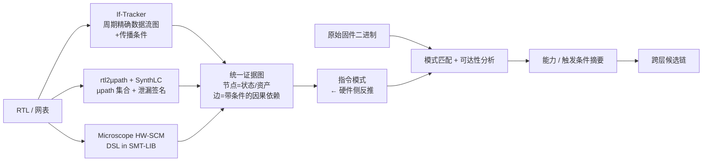

# 芯片跨层漏洞攻击链路分析：论文级方法调研

> 调研日期：2026-09-18
> 定位：本项目第五部分「芯片跨层级关联性漏洞智能分析」的方法论调研
> 与 `F:\qcx\跨层漏洞分析调研与工程方案.md`（GPT-6 Astra 方案，47 篇）的关系：本文**不重复**其已覆盖的 fuzzing / 重托管 / 工具清单，专注补上它最薄的一层——**"攻击链路"本身的因果建模方法论**，以及 2024–2026 年的新工作。

---

## 0. 阅读指引

Astra 方案的强项在工程落地（证据分级、对照实验、接口约定、误区清单），弱项在**方法论内核**：它把跨层链拆成 A/B/C 三条路线并行处理，但缺少一个能把三条路线**统一成同一个可推理对象**的形式化载体。本文的核心贡献就是补这个载体，并给出对口的论文依据。

结论先行：

| 你的三条思路 | 对应的论文级方法论 | 核心论文 |
|---|---|---|
| ① 固件漏洞 → 触发硬件漏洞 | 能力（Capability）抽象 + 硬件副作用可达性 | HardFails、Coppelia、HEAPSTER |
| ② 固件本身含触发硬件漏洞的代码段 | **从硬件侧反推软件指令模式**（因果推断） | **Microscope (ASP-DAC'24)**、Coppelia (MICRO'18) |
| ③ 硬件漏洞影响固件正常执行 | 硬件偏差约束下的故障传播 + 信息流契约 | ARMORY、Granite、Microscope |

其中思路②是**你被要求做的那件事的技术核心**，而 Astra 方案里对应的是 InSpectre Gadget（x86/Linux/推测执行场景），和 MCU 固件距离较远。真正对口的是 **Microscope**——它做的正是"给定硬件设计 + 安全性质，反推能激活该漏洞的软件指令模式"。

---

## 1. 问题重述：为什么"跨层"难

HardFails (USENIX Sec'19) 给出了这个领域最精准的问题定义：

> 现代 SoC 的安全验证被切分在硬件边界和软件边界内各自进行。硬件侧用形式化/仿真验证 RTL，软件侧用静态分析/fuzzing 验证程序。**两者之间存在保护缺口（protection gap）**——一类只有在软硬件交互中才暴露的缺陷，任何单层方法都检测不到，作者称之为 HardFails。

HardFails 的实证工作很值得引用：作者基于 RISC-V SoC 构造了**第一个真实软件可利用 RTL bug 的测试床**（30 个 buggy RTL 版本），并归纳出 5 类通用 bug 类别、25 条安全性质，在开源 RISC-V 与 OR1k 核上发现了新 bug。**这是目前最接近你项目需求的公开 benchmark**，可直接作为方法验证的语料。

关键洞察：这类漏洞的根因往往不在某个模块内部，而在**模块间的交互契约**上。因此跨层分析的第一个技术选择是：**用什么对象来刻画"契约"**。

---

## 2. 方法论内核：三种可推理的载体

文献中存在三条互不排斥的技术路线，各自把"跨层契约"编码成不同形式。**建议你的系统同时支持这三种载体，并让它们在同一个证据图里对齐。**

### 2.1 载体一：RTL 静态信息流（If-Tracker 路线）

**核心论文**：*Cross-party Formal Verification for Hardware Trust*（Zhaoxiang Liu 博士论文，Kansas State University，2026）
其中 **If-Tracker** 组件：把 RTL 解析为 AST，构造**周期精确的数据流图**，并**提取信息沿路径传播的条件**（不只是判断路径是否存在）。

为什么这个"提取条件"很重要：Astra 方案里用知识图谱做关联，边只有"存在/不存在"。而 If-Tracker 给出的是"信息从 A 流到 B **所需满足的赋值条件**"——这就把图上的边变成了可求解的约束。

**适用**：有 RTL 时，用于定位硬件内部的泄漏路径与跨模块交互风险（总线窃听、隐蔽信道、互连篡改、TrustZone 相关篡改）。
**局限**：需要 RTL；只覆盖信息流类性质。

### 2.2 载体二：硬件结构因果模型 HW-SCM（Microscope 路线）★ 最推荐

**核心论文**：*Microscope: Causality Inference Crossing the Hardware and Software Boundary from Hardware Perspective*，ASP-DAC 2024，DOI `10.1109/ASP-DAC58780.2024.10473793`
作者：Zhaoxiang Liu, Kejun Chen, Dean Sullivan, Orlando Arias, Raj Dutta, Yier Jin, Xiaolong Guo
（NSF 公开全文：`https://par.nsf.gov/servlets/purl/10671891`）

**方法**：
1. 在经典结构因果模型（SCM, Pearl）上叠加硬件特征（时序戳、多周期依赖），得到 **Hardware SCM**；
2. 用自定义 **DSL（SMT-LIB 编码）** 表示 HW-SCM 与预定义安全性质；
3. 用**增量式 SMT 求解**反推出**所有能满足安全性质的软件指令**。

**它与 Coppelia 的区别（关键）**：Coppelia 把 RTL 翻译成 C++ 再用 KLEE 符号执行——**翻译过程丢失 RTL 结构保真度**。Microscope 不做翻译，直接从硬件侧建模，因此可扩展性和精确性都更好。

**为什么这是你项目的最佳方法内核**：
- 它输出的正好是**"指令模式"**——即"哪条/哪类指令序列会激活这个硬件漏洞"。这正是导师的第②条思路；
- 该指令模式可以**直接和原始固件反汇编做匹配**，判断原固件里是否已经存在这样的片段（第②条），或者能否由固件漏洞（第①条）诱导产生；
- 安全性质用 SMT 表达，**天然支持"生成对照"**：修改性质或约束即可做消融实验。

**工程实现路径**：Z3/cvc5 + 自建 DSL 解析层；RTL 侧可用 Yosys 提取的网表作为 HW-SCM 的结构来源。

### 2.3 载体三：硬件—软件泄漏/功能契约（Granite / µspec 路线）

**核心论文**：
- *Granite: A Modular Methodology for Foundational Verification of Hardware-Software Leakage Contracts*（MIT，arXiv `2607.27480`）
- *Specification and Formal Verification of Hardware–Software Contracts for High-Assurance Computer Architectures*（IEEE Computer, 2025）——介绍 **rtl2µspec / rtl2µpath / SynthLC** 工具链

**方法要点**：
- **µpath**：指令的周期级状态更新序列。rtl2µpath 可从 SystemVerilog **自动合成**每条指令的完整 µpath 集合；
- **重要发现**：一条指令存在**多个可能的 µpath**（µpath variability），强烈指示该硬件存在侧信道；
- **SynthLC**：在 rtl2µpath 上叠加**符号信息流跟踪（symbolic IFT）**，自动合成完整的泄漏签名。在 RISC-V CVA6 核上合成出 94 个唯一泄漏签名、72 个 transponder、26 个 transmitter，并发现了一个**新的侧信道**（泄漏 load/store 地址操作数）以及一类新的推测干扰攻击；
- **Granite** 的价值在于**模块化组合**：子模块各自对自己的泄漏契约证明，证明可组合成整体保证，并把 ISA 契约本身从 TCB 中消除。它处理了异步中断、输入、未指定行为带来的非确定性。

**对你的用途**：当硬件漏洞是**侧信道类**（时序、缓存、资源竞争）时，这条路线给出的是论文级最强的证据形式。但它是"硬件是否满足契约"的证明，不是"固件能否触发"的搜索——**需要和 Microscope 的指令模式推断串联**。

### 2.4 三条载体的关系

**统一的原则**：所有载体的输出都归一化为**「带条件的、时序化的因果依赖边」**。这是把 Astra 方案里"知识图谱连线"升级为"可求解约束"的关键一步。

---

## 3. 逐条对应你的三条思路

### 3.1 思路①：固件漏洞触发硬件漏洞

**方法组合**：
1. **能力抽象**：从固件漏洞（GDBFuzz 给出的崩溃输入 + 污点分析）提取能力摘要 `F = (Entry, Condition, Primitive, Constraints, Evidence)`。Astra 方案已有此设计，此处补充**论文依据**：
   - HEAPSTER (IEEE S&P'22)：固件堆分配器识别 + 符号执行 + 有界检查，用于判断固件漏洞实际提供了什么内存操作能力；
   - FirmUSB (CCS'17)：**领域知识约束符号执行**——用接口协议知识缩小搜索空间。这条对固件分析很有价值，因为裸机固件的外部输入结构强约束。
2. **硬件副作用可达性**：这才是缺的一环。固件漏洞给出的能力（如"可控 DMA 描述符的某个字段"）必须**在 RTL 层面被证明能到达漏洞路径**。方法：把 Microscope 的 HW-SCM 反过来用——已知需要激活的硬件漏洞，求其**前置条件集合**（Pre），再检查固件能力能否满足 Pre。
3. **原始镜像约束**：所有求解结果必须是**报文/输入序列**，不能是新固件。Astra 方案 §3 论述充分，此处不重复。

**判定要点**（补充 Astra 的"crash ≠ 任意执行"）：固件漏洞的能力与硬件触发前提之间是**约束可满足性问题**，不是字符串匹配。必须输出求解结果（哪个字段取什么值）和不可满足时的最小冲突集。

### 3.2 思路②：固件本身含触发硬件漏洞的代码段 ★ 核心

这是导师三条思路中最可做、最能出成果、且**最贴合"不生成新 ELF"约束**的一条。因为：不需要构造新程序，只需要**在原始固件里找已存在的片段**。

**论文级方法**：

**方法 A：Microscope 反推 + 固件匹配（推荐主线）**
- 输入：硬件漏洞描述（或安全性质违反）
- Microscope 输出：能激活该漏洞的**指令模式集合**（SMT 模型的所有解）
- 动作：把指令模式编译成**架构级匹配模式**（操作类别 + 操作数关系 + 常量约束 + 时序/顺序约束），在原始固件 CFG 上做**语义匹配**（不是字符串匹配）
- 验证：匹配到的候选点向后切片求输入约束，向前切片确认影响对象

**方法 B：反向切片 + 指令级逆向（Coppelia 思想）**
**核心论文**：*End-to-End Automated Exploit Generation for Validating the Security of Processor Designs*，MICRO 2018
作者：Rui Zhang, Calvin Deutschbein, Peng Huang, Cynthia Sturton (UNC)
成果：在 3 个不同架构 CPU 上，为 31 个已知漏洞中的 29 个生成了利用程序，其中 **11 个是商用和学术界模型检查工具都找不到的**；全部可在 FPGA 板上成功重放；另外发现 4 个新漏洞。
**方法要点**：硬件侧的后向符号执行引擎 + **cycle stitching（周期缝合）**方法 + 快速验证技术，再补上程序桩（program stubs）构成完整利用。
**对你最重要的一句话**：Coppelia 生成的是"**触发 + 载荷**"的完整软件利用程序，即它把硬件漏洞**翻译成了软件侧要做什么**。你的固件匹配就是在问"原固件是否已经做了这件事"，而 Astra 方案明确排除的是"我把这件事编进固件再运行"。

**方法 C：片段级可利用性分析（Astra R31/R33 路线的 MCU 化）**
- InSpectre Gadget (USENIX Sec'24)、Teapot (CGO'25)：面向 COTS 二进制的片段扫描 + 约束求解。
- 启示：**"片段存在"≠"片段可用"**，必须求（a）可达性（b）操作数可控性（c）影响传播。Teapot 是"高效发现"的范式，但运行在 x86/Linux 场景，需重做 MCU 语义。

**技术难点（必须提前认知）**：
- **Microscope 的输出是指令模式，固件是编译产物**。编译器可能把一条高级语句拆成多条指令、把常量折叠、把条件反转。因此匹配必须建立在**数据依赖语义**上，而非指令序列的语法形式。
- 建议：先用 **P-code（Ghidra）或 VEX（Valgrind/angr）** 统一提升为 IR，在 IR 层做匹配，避免为 5 种 ISA 各写一套匹配器。

### 3.3 思路③：硬件漏洞影响固件正常执行

**方法组合**：

1. **故障模型绑定**：ARMORY (IEEE TIFS'21) 的思路——对 ARM-M 二进制做**穷尽式多变量故障仿真**（工具 `M-ulator`；代码 `github.com/emsec/arm-fault-simulator`）。
   **ARMORY 两个极有价值的结论**：
   - 大量可被利用的故障**只在机器码层面可见**（考虑地址和偏移后），在 C 代码甚至带标签的汇编层面完全看不到；
   - **针对某类故障的对策，可能大幅增加对其他故障模型的脆弱性**——这在文献里被明确证明。
   对你的意义：路线③的影响分析必须在机器码层做，不能停在 C/伪代码层；"固件已经加了防护"不能作为漏洞不成立的论据。

2. **偏差约束（区别于任意注入）**：Astra 方案正确指出"注入任意 bit flip 后固件出错 ≠ 存在真实硬件漏洞"。方法论补充：
   - 用 Microscope 从硬件侧求出**该硬件漏洞实际能产生的偏差集合** `Deviation`；
   - 用 `Deviation` **约束** ARMORY/FaultFinder 的故障注入位置与类型；
   - 这形成"硬件可实现错误集合约束固件影响分析"的闭环——Astra 方案 §12 把这条列为创新点，此处给出**具体实现方法**（约束来自 HW-SCM 求解，而非人工指定）。

3. **契约违反的证据形式**：Granite 的"泄漏感知精化"（leakage-aware refinement）。若要证明"硬件偏差确实传播到了安全资产"，最强的证据形式是**迹等价（trace equivalence）**：证明被观测量的周期级行为完全由契约中规定的可观察量决定。工程上可用更弱的替代（差分执行 + 观测点断言）。

**判定要点**（补充 Astra §8.2）：除了它列出的判断规则，增加一条——
> 若硬件偏差**被固件的错误处理/冗余机制纠正**，则不成立。因此路线③必须显式检查固件侧的**纠正路径**（看门狗、重试、CRC、双读比较），并把"被纠正"作为独立的负例类别。

---

## 4. 跨层反馈与搜索：从"覆盖率"升级为"因果进展"

Astra 方案 §12 提出了分阶段多目标调度，方向正确但没有给出**可操作的反馈信号**。论文级补充：

| 反馈层级 | 信号来源 | 论文依据 |
|---|---|---|
| L1 到达目标代码 | CFG 距离、调用上下文 | AFLGo (CCS'17) |
| L2 满足触发条件 | **HW-SCM 前提的满足度**（SMT 模型的前缀进展） | Microscope |
| L3 硬件状态覆盖 | **CSR 转移**（ProcessorFuzz）、**µpath 变异性**（SynthLC）、**微架构状态转移**（WhisperFuzz） | HOST'23 / IEEE Computer'25 / USENIX Sec'24 |
| L4 安全影响 | **安全代价函数**（SoCFuzzer）、信息流标签传播 | DATE'23 |

**关键改进**：L2 的反馈信号不是"覆盖率百分比"，而是**"距离满足 HW-SCM 前置条件还差哪个约束"**。例如求解器可以返回"还缺一个能把寄存器 R 设为 0 的写操作"。这是一个**可解释的、定向的**信号，比覆盖率强得多，也正是项目书要求"关联漏洞命中率不低于 80%"的技术支撑。

**搜索策略**：FuSS (ACM TECS 2025) 的做法值得借鉴——当硬件 fuzzing 到达**覆盖平台期**时，用**选择性符号执行**从**已有 fuzzing 轨迹**出发构造最小输入序列以到达难以激活的区域。**不要从初始状态重新求解**（这是 HyPFuzz 等 property-checking 方法的局限）。对你的场景：从固件实际执行到的状态出发做局部求解，而不是符号化整个固件。

---

## 5. LLM 在第五部分中的正确定位

Astra §13 的定位（LLM 处理半结构化材料、真正的链成立交给求解器和观测）是稳妥的。补充 2025–2026 的最新证据，用于支撑项目书"大模型辅助"的要求：

**可引用的工作**：
- *LLM-HyPZ*（ICDMW 2025）：LLM 辅助的**零样本知识抽取**，对 2021–2024 共 114,836 条 CVE 语料挖掘出 1,742 条硬件相关漏洞，归纳为 5 个主题；LLaMA 3.3 70B 在验证集上达到 99.5% 分类准确率。该流水线**实际支撑了 MITRE CWE MIHW 2025 更新**（从 1,026 条候选中筛出 411 条）。
- *Leveraging LLMs for Secure Hardware Verification and Analysis*（AsianHOST 2025）：**这是一篇批评性综述**。核心结论：当前 LLM 驱动的方案"**在过度简化的场景下开发，在不同硬件设计上性能不稳定**"；提出三个方向——标准化安全基准、领域特定语义推理能力、与验证工具的紧密集成。
- *Securing LLM-Generated Embedded Firmware through AI Agent-Driven Validation and Patching*（arXiv `2509.09970`，2025）：结构化验证流水线可修复 LLM 生成固件中 92.4% 的漏洞，比基线提升 37.3%。

**给你的建议（重要）**：
> 项目书写"大模型辅助"，但 AsianHOST'25 的批评性综述已经明确指出当前 LLM 硬件安全方案的**不稳定性和简化场景问题**。因此你的技术报告应当**主动承认这一点**，并把 LLM 的可用性论证落在**可量化的消融实验**上（契约字段准确率、无来源字段比例、人工修订时间、去掉 LLM 后真实链检出率的变化）。Astra §13 提了这些指标，但没提**已有文献已经批评过**——引用 AsianHOST'25 会让你的方案在答辩时更站得住。

**LLM 的具体用法**（工程上真正可行的）：
1. 从**手册/勘误表/SVD** 中抽取寄存器、位域、权限、时序条件 → 候选触发契约；
2. 把 Microscope 输出的 SMT 指令模式**翻译成人可读的语义描述**，供人工审核；
3. 从漏洞报告生成**性质候选**（安全性质形式化）；
4. 在 IR 层辅助**识别固件中的接口/协议处理函数**。
**禁止**：让 LLM 直接输出"攻击链成立"的结论，或补全不存在的寄存器/权限。

---

## 6. Benchmark 与评估

Astra §16 的评估设计是完整的，补充**可用的公开语料**：

| 语料 | 内容 | 用途 |
|---|---|---|
| **HardFails RTL 测试床** | 30 个 buggy RTL 版本（基于 RISC-V SoC），5 类 bug，25 条安全性质 | 硬件侧起点；可直接用于 Microscope 式反推验证 |
| **Coppelia 的 3 个 CPU + 31 个已知漏洞** | 含 11 个模型检查器找不到的 | 用于验证"指令模式反推"的正确性（有 ground truth） |
| **CVA6 泄漏签名（SynthLC）** | 94 个唯一泄漏签名、72 transponder、26 transmitter | 侧信道类漏洞的对照基准 |
| **MITRE CWE MIHW 2025 / CWE Hardware List** | 硬件弱点分类 | 漏洞类型分类、样本库标签体系 |
| **处理器开源 RTL** | Rocket、BOOM、BlackParrot（ProcessorFuzz 用过）、CVA6、DarkRISCV | 无甲方 RTL 时的替代平台 |

**样本库设计的补充建议**（回应项目书"不少于 100 条"）：
Astra 已正确指出"100 条"应按三类合计且不应重复计数。补充**样本的因果结构标注**——每条样本除了 Astra 列出的字段，还应标注：
- **因果边级证据**：该链有几条边、每条边的证据级别（E0–E4）分别是什么；
- **反事实**：去掉哪条边后链失效（这是"链"与"漏洞列表"的根本区别）；
- **HW-SCM 约束集**：该链涉及的触发约束（可用于跨样本的约束复用统计）。

---

## 7. 关键风险与应对

| 风险 | 论文依据 | 应对 |
|---|---|---|
| Microscope 输出的是**指令模式**，固件是**编译产物**，形态不匹配 | Coppelia 的 program stubs 问题 | 在 IR（P-code/VEX）层匹配；用符号执行而非语法匹配 |
| 硬件漏洞的**偏差集合**可能无法从 RTL 完整求出（状态爆炸） | FuSS 指出 property checking 的状态空间爆炸 | 用"从实际轨迹出发的选择性符号执行"，而非全状态求解 |
| 侧信道类漏洞**无法用 crash 判据** | WhisperFuzz、SynthLC | 必须建立**统计/关系型判据**，单独一类 oracle |
| 五架构 × 四层能力（L1–L4）的真实工作量 | Astra §14 已有正确判断 | 先做 RISC-V 单一实现级闭环，其余架构只做 L1–L2 |
| LLM 输出不可靠 | AsianHOST'25 批评性综述 | 消融实验 + 字段级溯源 + 人工修订记录 |
| 把**纠正路径**误判为漏洞不成立 | ARMORY 的"对策可能加剧其他脆弱性" | 把"被纠正"作为独立负例类别显式建模 |

---

## 8. 本轮的未决事项

- Microscope 与 SynthLC 的**公开实现可用性**未核实（Microscope 来自 Kansas State，SynthLC 来自 MIT/Penn 系；需确认是否开源、支持哪些 RTL 子集）。
- HardFails 测试床的**获取方式**未核实（论文提到 RISC-V SoC testbed，需查是否随论文发布）。
- If-Tracker 目前只在博士论文中出现，**是否已发表独立论文/开源**未核实。
- 甲方架构/固件类型未提供，无法确定哪条载体优先（若为带缓存的 AP 类处理器，载体三权重上升；若为裸机 MCU，载体二权重上升）。
- 本文未进行任何工具安装与复现；未在真实目标上验证任何方法。

---

## 附：本轮新增的关键文献清单

| 编号 | 文献 | 会议/期刊 | 核心贡献 | 对第五部分的作用 |
|---|---|---|---|---|
| N01 | **Microscope: Causality Inference Crossing the Hardware and Software Boundary** | ASP-DAC 2024 | HW-SCM + SMT-LIB DSL 反推软件指令模式 | ★★★ 思路②的方法内核 |
| N02 | **Coppelia: End-to-End Automated Exploit Generation for Validating the Security of Processor Designs** | MICRO 2018 | 硬件侧后向符号执行 + cycle stitching，生成可重放软件利用 | ★★★ 思路①②；有 ground truth 可做基准 |
| N03 | **Granite: Modular Verification of Hardware-Software Leakage Contracts** | arXiv 2607.27480 (MIT) | 泄漏感知精化；模块化组合；迹等价证明 | ★★ 思路③的最强证据形式 |
| N04 | **Specification and Formal Verification of Hardware–Software Contracts** (rtl2µspec / rtl2µpath / SynthLC) | IEEE Computer 2025 | µpath 自动合成；µpath 变异性指示侧信道；RISC-V CVA6 上发现新侧信道 | ★★★ 侧信道类漏洞的自动化方法 |
| N05 | **LLM-HyPZ: Hardware Vulnerability Discovery Using an LLM-Assisted Hybrid Platform** | ICDMW 2025 | 零样本知识抽取，114,836 CVE → 1,742 硬件漏洞；支撑 MITRE MIHW 2025 | ★★ 支撑项目书"大模型辅助" |
| N06 | **Leveraging LLMs for Secure Hardware Verification and Analysis**（综述） | AsianHOST 2025 | **批评性综述**：LLM 硬件安全方案在简化场景下开发、性能不稳定 | ★★ 风险披露与答辩防御 |
| N07 | **FuSS: Coverage-Directed Hardware Fuzzing with Selective Symbolic Execution** | ACM TECS 2025 | 覆盖平台期用选择性符号执行；从已有轨迹构造最小输入序列 | ★★ 搜索策略的直接依据 |
| N08 | **SoCFuzzer** | DATE 2023 | 安全代价函数引导；明确指出既往工作"缺乏跨层协同验证" | ★★ 跨层反馈信号 |
| N09 | **GEmFuzz** | ASP-DAC 2026 | 免黄金参考模型的仿真式 fuzzing；事件监控检测漏洞 | ★ 系统级验证新方向 |
| N10 | **Cross-party Formal Verification for Hardware Trust**（If-Tracker） | 博士论文 2026 | RTL 静态信息流 + 传播条件提取 | ★★ 有 RTL 时的硬件侧起点 |
| N11 | **Hardware/software security co-verification: An information flow perspective** | Integration 2024 | 统一软硬件信息流模型 + IFTM | ★★ 需全文核实 |
| N12 | **Hardware and software co-verification from security perspective in SoC platforms** | JSA 2022 | RISC-V SoC 运行时 DIFT 协处理器（Verifier-Prover） | ★ 运行时协同验证架构参考 |

> 与 Astra 方案 R01–R47 合并后，第五部分可引用的文献规模达到约 59 项。建议在报告中明确区分"工具清单"（Astra 已做）与"方法内核"（本文补充），避免把工具罗列当方法创新。
