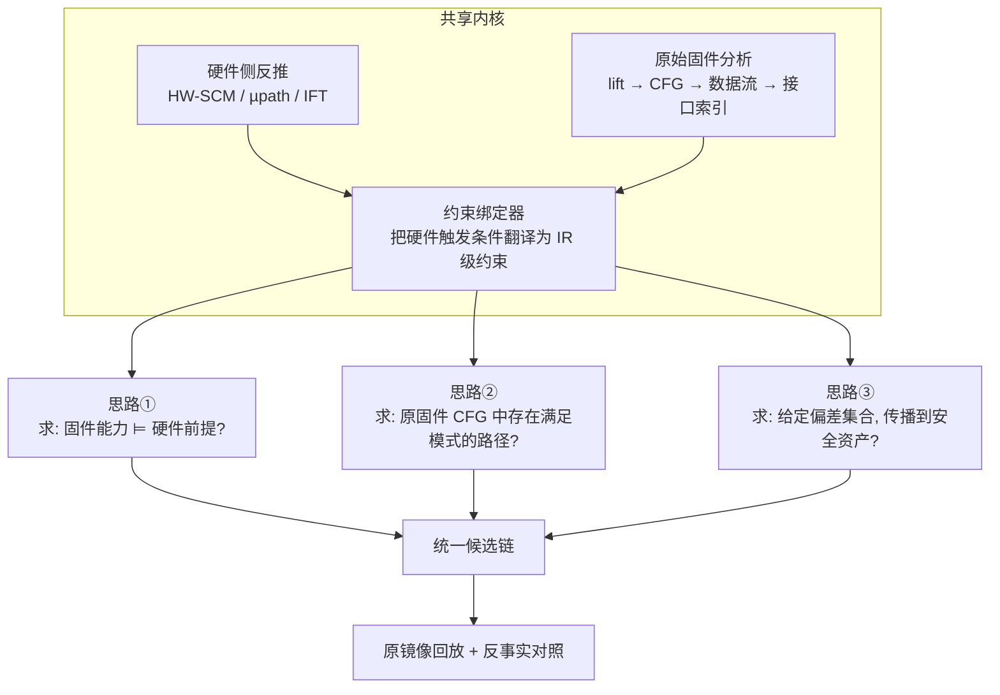

# 芯片跨层漏洞攻击链路分析：工程框架设计

> 配套文档：`01-跨层漏洞攻击链路-方法调研.md`（方法论依据）
> 参考基线：`F:\qcx\跨层漏洞分析调研与工程方案.md`（GPT-6 Astra 方案）
> 本文给出：技术路线选型 → 数据模型 → 模块划分 → 工具栈 → 实施阶段 → 接口约定

---

## 1. 总体技术路线

### 1.1 一句话定位

> **以硬件侧反推出的"触发契约"为靶标，在原始固件二进制上求解可达触发路径与真实输入序列，通过目标硬件观测和反事实对照，输出带因果证据的跨层攻击链。**

关键词：**原始固件不可替换** / **靶标来自硬件侧反推** / **因果证据而非相关性**。

### 1.2 与 Astra 方案的关系

Astra 方案给出的路线是：

```
上游分析结果 → 契约/能力 → 固件语义分析 → 候选链 → 定向搜索 → 回放 → 对照 → 报告
```

这个骨架是对的。本文**保留骨架，替换两处内核**：

| 环节 | Astra 方案 | 本文改进 | 理由 |
|---|---|---|---|
| 候选链生成 | 知识图谱语义关联 + 指令模式匹配 | **HW-SCM 因果反推（Microscope）+ IR 层语义匹配** | 图谱连接是"相关性"；HW-SCM 求解给出的是"带条件的因果依赖"，可求解、可否定、可生成反事实 |
| 定向搜索反馈 | 分阶段覆盖率/路径距离 | **约束进展度（距离满足 HW-SCM 前提还差哪个约束）** | 覆盖率与"能否触发硬件漏洞"是弱相关；约束进展是直接信号 |

其余（证据分级、对照实验设计、接口约定、误区清单）**建议直接沿用 Astra 方案**，它在这几块做得扎实。

### 1.3 三条思路的统一处理

不要把三条思路做成三个独立流程——它们共享同一个分析对象，只是**求解方向不同**：



**三种求解问题的形式化**（设原始固件 `B`，硬件 `D`，初态 `s0`，输入 `u`，环境事件 `e`）：

| 思路 | 求解目标 | 输入来源 | 输出 |
|---|---|---|---|
| ① | `∃u: Reach(B,u) ∧ Cap(C_fw) ∧ Cap(C_fw) ⊨ Pre(H)` | 固件漏洞报告 + 硬件契约 | 输入序列 + 能力到前提的映射 |
| ② | `∃u: Reach(B,u) ∧ Pattern_SMT(τ_B) ∧ Trigger(H)` | 硬件契约 + 原固件 CFG | 可达片段 + 输入约束 |
| ③ | `∀d ∈ Deviation(H): Propagate(B, d) → Violate(Q)` | 硬件偏差集合 + 原固件 | 受影响资产 + 纠正路径分析 |

注意③用的是 `∀d` 而非 `∃d`——**只在硬件实际能产生的偏差范围内讨论**，这是与"随便注入 bit flip"的根本区别。

---

## 2. 数据模型：跨层证据图（CLEG）

这是整个系统的核心数据结构。相比纯知识图谱，**每条边都是带条件的、时序化的、可反驳的**。

### 2.1 节点类型

```
FirmwareImage        固件镜像（含 SHA-256、段布局、入口、Boot ROM 依赖）
CodeLocation         代码位置（ISA、地址、所属函数、所属接口）
InstructionFragment  指令片段（IR 级，非原始字节）
InputEntry           外部输入入口（接口类型、协议、权限）
Capability           固件能力摘要
HardwareComponent    硬件组件（模块名、RTL 来源、版本）
Register / RegField  寄存器/位域（绑定具体平台版本）
AddressSpace         地址空间（属性：可读/可写/特权/缓存性）
TriggerContract      硬件触发契约
Deviation            硬件偏差（相对规范的错误行为）
SecurityProperty     安全性质（机密性/完整性/隔离性/可用性）
Experiment           实验实例（镜像哈希、输入、观测、结果）
Evidence             证据（原始日志/波形/轨迹，内容寻址存储）
```

### 2.2 边类型（关键是每条边都带条件）

| 边 | 语义 | 必须带的字段 |
|---|---|---|
| `controls` | 数据流控制关系 | **条件约束**（SMT 表达式） |
| `reaches` | 控制流可达 | 可达性前提、路径长度 |
| `requires` | 前提依赖 | 约束集合、是否已满足 |
| `produces` | 产生能力/偏差 | 能力签名或偏差签名 |
| `triggers` | 触发硬件事件 | 时序窗口、并发条件 |
| `violates` | 违反安全性质 | 性质 ID、违反证据指针 |
| `observed_in` | 在实验中观测到 | 实验 ID、扰动等级 |
| `refuted_by` | 被实验反驳 | 反驳实验 ID、最小冲突集 |
| `equivalent_to` | 跨层次语义等价 | 等价依据、置信度 |

### 2.3 边必须区分「推理边」与「观测边」

- **推理边**：来自静态分析 / SMT 求解 / LLM 抽取。可被反驳，证据级别 ≤ E1。
- **观测边**：来自实验观测（RTL 波形、板上 trace）。证据级别 ≥ E2。

**报告中绝不允许把推理边渲染成和观测边一样的外观。** Astra §9 的证据分级应直接落到边的字段上。

### 2.4 存储选型

初期：**SQLite + JSON 列**存储节点/边，大体量轨迹（波形、trace）放内容寻址文件（`artifacts/<sha256>`），数据库只存指针。

不建议一开始上 Neo4j：图数据库解决的是"关系遍历"，而本项目真正的难点是**边的条件约束求解**和**因果性**，这两点图数据库都不提供。等边数量超过约 10⁵ 或需要交互式探索时再迁移。

---

## 3. 模块划分

```
src/crosslayer/
  importers/        上游材料导入与身份固定
  contracts/        触发契约 / 能力 / 安全性质的类型化表示
  lifting/          多 ISA 二进制 → 统一 IR（P-code / VEX）
  hw_model/         硬件侧建模：HW-SCM / µpath / 信息流图
  hw_infer/         硬件侧反推：SMT 求解指令模式
  binary_analysis/  CFG / 数据流 / 切片 / 接口索引
  matcher/          IR 层语义匹配（硬件模式 ↔ 固件片段）
  reasoning/        候选链生成、前提检查、排序
  search/           输入变异、约束进展反馈、局部求解
  backends/         gdb / openocd / rtl-sim / qemu / renode 适配
  protocols/        按目标实现真实输入（serial / usb / socket / can）
  oracles/          触发判定 / 偏差判定 / 安全性质判定
  validation/       回放、对照、最小化、根因切片
  evidence/         证据图存储与查询
  reporting/        报告生成
schemas/            JSON Schema（节点、边、契约、实验）
targets/<target-id>/ 每个目标平台的配置
artifacts/<sha256>/  内容寻址的原始材料
experiments/<run-id>/ 实验记录
```

### 3.1 各模块要点

**`hw_model` + `hw_infer`（新增，Astra 方案没有）**

这是本文的核心增量。职责：

1. 从 RTL（Verilog/SystemVerilog）或上游硬件漏洞报告，构造 **HW-SCM**：节点为硬件状态信号，边为多周期因果依赖，带时序戳；
2. 用 SMT-LIB DSL 编码安全性质；
3. 增量式 SMT 求解，输出**所有满足条件的软件指令模式**（不是单个解——所有解才构成完整的触发模式集合）；
4. 无 RTL 时：退化为从上游漏洞报告人工/LLM 辅助构造契约，并**明确标注为低证据级别**。

技术栈：Z3（或 cvc5）+ 自建 DSL 解析器；RTL 结构来源可用 Yosys 网表。

**`lifting`（多架构关键）**

统一 IR 是支撑"5 种架构"的唯一现实路径。否则要为 RISC-V / ARM / SPARC / PowerPC / LoongArch 各写一套匹配器，工作量不可控。

- 首选 **Ghidra P-code**：反汇编器覆盖广，P-code 是成熟的统一 IR，且有 Python/Java API（Headless 模式可脚本化）；
- 备选 **angr 的 P-code 引擎** 用于符号执行；
- 需逐架构验证：异常语义、特权指令、大小端、地址映射——**反汇编支持 ≠ 语义支持**（Astra §11.2 已提示）。

**`matcher`（思路②的执行体）**

输入：HW-SCM 求解出的指令模式（IR 级约束）
输出：原固件中满足该模式的候选片段 + 输入约束

匹配策略（由粗到细，逐级过滤）：
1. **操作类别筛选**（如"需要一次除法""需要一次内存写"）——快速排除 99%
2. **常量/位域约束筛选**
3. **数据依赖语义验证**（在 IR 上验证操作数关系，非字符串匹配）
4. **路径可达性验证**（CFG 可达 + 调用上下文 + 中断上下文）
5. **操作数可控性求解**（后向切片 → 求输入约束 → 局部符号执行）

**关键**：第 5 步的输出必须是**输入序列**，不是新代码。

**`oracles`（判别器，容易被低估）**

至少三类独立判别器，不能用同一个：
- **触发判定**：硬件偏差是否发生（架构差分 / 断言 / 波形）
- **偏差判定**：偏差是否属于预期类型（排除 ISA 未定义行为、参考模型错误）
- **安全性质判定**：
  - 功能性性质 → 断言
  - 泄漏类性质 → **统计/关系判据**（不能用 crash 判据替代）
  - 访问控制类 → 权限检查轨迹

**`validation`（Astra 方案的亮点，建议完整保留）**

目录中 `validation/` 的职责就是 Astra §9 的对照实验设计。补充一条实现建议：
- 反事实对照应实现为**图上的边消减实验**——对候选链的每条边，构造一个"仅消除该边"的实验，验证链是否失效。这需要 `contracts` 支持"边级开关"，是数据模型上的额外要求。

---

## 4. 工具栈选型

### 4.1 必选（P0-P1 阶段）

| 用途 | 工具 | 依据 / 备注 |
|---|---|---|
| 二进制 IR 提升 | **Ghidra + P-code**（Headless） | 多架构统一入口；反汇编覆盖 5 种目标 ISA |
| 符号执行 / 约束求解 | **angr + Z3** | 后向切片、操作数可控性求解 |
| HW-SCM 求解 | **Z3 / cvc5** + 自建 DSL | Microscope 路线的工程化 |
| 真实板卡反馈 | **GDBFuzz + OpenOCD / 厂商 GDB Server** | 硬件断点反馈；与"不替换固件"约束天然契合。注意 GDBFuzz 官方仓库 2025-01-20 已归档，需固定版本并自维护适配层 |
| 硬件上游线索 | **ProcessorFuzz** | CSR 转移反馈；论文验证 Rocket / BOOM / BlackParrot |
| 证据存储 | **SQLite + JSON** + 内容寻址文件 | 起步够用 |

### 4.2 按条件启用

| 用途 | 工具 | 启用条件 |
|---|---|---|
| RTL 结构提取 | **Yosys** | 有 RTL |
| RTL 仿真 / 协同仿真 | **Verilator**；**Renode + Verilator** | 有 RTL；且缺陷位于可隔离外设。**若缺陷在 CPU 流水线/缓存，不能让正确的模拟 CPU 替换有漏洞的目标 CPU** |
| 形式化性质检查 | **SymbiYosys（开源）/ JasperGold（商用）** | 有 RTL + 授权 |
| 侧信道契约验证 | SynthLC / rtl2µpath | 有 RTL，且目标是侧信道类漏洞。**先核实可用性** |
| 固件重托管 | **Fuzzware / P²IM / DICE / AIM** | 按 MMIO / DMA / 中断需求选择。定位是**候选生成**，目标相关硬件行为必须保留或回实机 |
| 故障影响分析 | **ARMORY**（`github.com/emsec/arm-fault-simulator`）；**FaultFinder** | 思路③。偏差模型必须由硬件契约约束 |
| 定向搜索 | **AFLGo**（借鉴调度策略）/ **LibAFL**（后期自定义） | 注意：AFLGo 原版依赖编译插桩，**不能直接用于不可替换的原始固件**；只借鉴调度算法 |
| 混合求解 | **Driller** 思想 | fuzzing 停滞时选择性符号执行；需补 MMIO / 异常 / 中断模型 |
| 差分 fuzzing | **DifuzzRTL** 思想 | 需黄金参考模型 |
| 编排 | **Avatar²** | 可借鉴或复用；适配复杂时直接写少量后端更轻 |

### 4.3 明确不使用（或需谨慎）

| 工具 | 问题 |
|---|---|
| InSpectre Gadget / Teapot | x86 / Linux / 推测执行场景，与 MCU 固件距离远。思想可借鉴，工具不能直接套用 |
| FIRM-AFL | 面向 Linux/POSIX 固件，不适用于裸机 MCU |
| QEMU（作为目标 CPU 的替代） | 用正确的模拟 CPU 去验证未建模的目标微架构缺陷，是逻辑错误。QEMU 只能用于功能仿真和路径探索 |
| HALucinator（验证层） | 若替换了目标驱动/交互，便不能据此验证**该层**的漏洞。只能用于硬件无关路径的预分析 |

---

## 5. 工程实现优先级

### 5.1 分阶段路线

| 阶段 | 交付物 | 完成标准 | 前置条件 |
|---|---|---|---|
| **P0** 数据模型与导入 | CLEG schema、导入器（ProcessorFuzz/GDBFuzz/通用报告） | 能导入 1 份公开硬件反例 + 1 份固件报告，并明确列出缺失字段 | 无 |
| **P1** 固件侧主线 | lift → CFG → 接口索引 → 数据流 | 候选能追溯到**原始地址**和**具体状态约束** | 1 个公开固件镜像 |
| **P2** 硬件反推 | HW-SCM DSL + SMT 求解 + IR 层匹配器 | 在 HardFails/Coppelia 的**已知漏洞**上复现出正确指令模式 | 公开 RTL |
| **P3** 最小闭环 | 单架构 + 单类确定性漏洞 + 真实输入搜索 + **同镜像回放** | 至少 1 个确实可达的案例 + 1 个不可达的理论负例 | RTL 或板卡其一 |
| **P4** 实现级验证 | 同一镜像在目标 RTL/参考模型上执行 + 性质判据 + 因果对照 | 能解释**第一处硬件偏差**及固件影响，而不是只有 crash | RTL |
| **P5** 板卡接入 | 输入 / 复位 / 断点-trace / 低扰动验证 | 完成 E4 级验证，记录重放成功率与环境限制 | 甲方板卡 |
| **P6** 扩展与评估 | 路线①③ + 多架构 + LLM/图谱 + 消融实验 | 独立基准、明确的失败类型、可复现实验 | 前三阶段稳定 |

### 5.2 先做什么（无甲方资料的当下）

**建议立即启动的范围**（窄化，可单人推进）：

> **路线②的窄化版本：已知的、架构可见的硬件功能/权限偏差 + 原固件中已存在的代码片段 + 真实输入约束求解 + RTL/参考对照。**

理由：
1. **不依赖甲方**——用公开 RTL（Rocket / CVA6 / DarkRISCV）+ 公开固件镜像即可建立全流程；
2. **有 ground truth**——HardFails 的 30 个 buggy RTL、Coppelia 的 31 个已知漏洞，可直接验证"硬件反推出的指令模式是否正确"；
3. **最贴合"不生成新 ELF"约束**——因为找的是**原固件里已有的片段**；
4. **单人可完成**——不需要构造完整攻击链，只需证明"片段存在 + 可达 + 操作数可控"。

P2 成功后接路线①（引入固件漏洞能力），最后接路线③（引入受约束的偏差传播）。

### 5.3 需要向导师/甲方确认的事项

**给上游硬件组**（除 Astra §10.1 已列内容外，补充三项）：
- **RTL 是否可获得**？若可，什么形式（源码/Synthesizable 子集/网表）？这决定 `hw_model` 走 SMT 路线还是退化为人工契约。
- **硬件漏洞的"偏差集合"能否给出**？即：该漏洞实际能产生哪些错误行为（错误载入值/漏掉异常/错误结果/DMA 越界/状态陈旧）？这直接约束思路③。
- **是否有形式化性质**？（如 HardFails 的 25 条安全性质）有的话可作为 HW-SCM 的安全性质量化直接复用。

**给上游固件组**（除 Astra §10.2 已列内容外，补充三项）：
- **固件漏洞的"能力签名"**：不能只给 crash，需要"可控字节范围 / 可控字段 / 可控长度 / 可达接口"的精确描述。这是思路①的前提。
- **外部输入面清单及权限**：真实攻击者能到达哪些接口、以什么权限。**JTAG/GDB 属分析者能力，不得计入攻击者威胁模型**（Astra §10.3 已强调，此处再次确认执行）。
- **正常运行基线**：正常输入下的行为、超时、看门狗、复位方式——用于区分"偏差"与"正常"。

**给导师**：
- 第五部分的**"命中率 80%"的口径**：是 Precision 还是 Recall？分母是什么？建议同时报告两者 + 置信区间。
- **"关联漏洞命中率"的判定主体**：是"图谱关联命中"还是"真实回放成功"？两者难度差两个数量级，必须区分。
- **五架构是 L1 还是 L4**？Astra §14 的四层能力表建议直接作为沟通工具。

---

## 6. 关键技术难点与应对

### 难点 1：硬件指令模式 ↔ 固件编译产物的语义鸿沟

**问题**：HW-SCM 反推出的是"指令模式"（语义层），固件是编译器产物（可能常量折叠、指令重排、条件反转）。

**应对**：
- 在 **IR 层**（P-code）做匹配，不在汇编层；
- 匹配条件建立在**数据依赖语义**上（"存在一条数据流从输入字段到该操作数"），而非指令序列形式；
- 对编译器优化后的等价形式建立**规范化规则**（常量折叠的逆、条件反转的等价、指令合并的展开）。

### 难点 2：约束进展度反馈的实现

**问题**：如何把"距离满足 HW-SCM 前置条件还差什么"变成 fuzzing 能用的适应度？

**应对**：
- 把 HW-SCM 前置条件分解为一组**可独立检查的谓词**（如 `R_x == 0`、`mem[addr] 的 bit 3 == 1`）；
- 在固件的**观察点**（不改变语义的读取，或用 trace 而非轮询）上检查每个谓词的满足状态；
- 适应度 = 满足谓词数 / 总谓词数；
- **注意**：CSR/MMIO 读可能有副作用，轮询可能改变总线时序。优先用 trace；无 trace 时设计少量观察点，并最终做低扰动回放。

### 难点 3：五架构的真实成本

**不回避**：Astra §14 的 L1–L4 分层是正确处理方式。**Ghidra 或 QEMU 的多架构支持，只等价于 L1–L2，不等于 L3–L4。**

建议：
- 立即做 RISC-V 的 **完整 L1–L4**（便于对接 ProcessorFuzz 与公开 RTL）；
- 其余四架构先完成 **L1–L2**（导入 + 静态语义验证，用**微测试**逐项验证指令/特权/异常/大小端/地址映射）；
- L3–L4 需要甲方提供对应平台，**列为资源依赖项而非技术依赖项**。

### 难点 4：侧信道类的判据

**不能用 crash 判据**。需要：
- 统计判据（重复测量、置信区间、控制公开输入）；
- 关系判据（非干扰：秘密变化不改变可观察量）；
- 有 RTL 时可用 SynthLC 式的**泄漏签名**作为对照。

**纪律**：一次计时差不是泄漏证据。

### 难点 5：固件侧的纠正路径

思路③必须显式建模固件的**纠正机制**（看门狗、CRC、双读比较、重试、错误处理分支）。处理方式：
- 在 `binary_analysis` 中把纠正路径标为一类特殊的 CodeLocation；
- 在 `reasoning` 中，"偏差被纠正"作为一个独立的**负例类别**；
- **注意 ARMORY 的发现**：针对某类故障的防护可能**加剧**对其他故障模型的脆弱性。因此不能因为"固件有防护"就排除该路径。

---

## 7. 与项目书技术指标的对应

| 项目书指标 | 本框架的支撑点 | 风险 |
|---|---|---|
| 支持架构类型不少于 5 类（RISC-V/ARM/SPARC/PowerPC/LoongArch） | 统一 IR（P-code）+ 微测试验证；L1–L2 全架构 / L3–L4 按资源 | **高**：L3–L4 依赖甲方平台 |
| 关联漏洞命中率不低于 80% | 约束进展度反馈 + 反事实验证 | **口径风险**：需与导师确认 Precision/Recall |
| 构建芯片漏洞样本库 1 个，含固件/硬件/固-硬件跨层样本不少于 100 条 | HardFails（30 RTL）+ Coppelia（31 漏洞）+ CVA6 泄漏签名 + CWE MIHW 2025 分类 | **口径风险**：三类合计，且应统计独立根因数与变体数 |
| 漏洞源定位误差小于 5 行 | 本框架输出 PC / 指令 / 函数 / 硬件模块位置 | **口径风险**：无源码/DWARF 时不能把反编译伪代码行号当源码行号 |
| 大模型辅助的跨层指令行为建模 | LLM 用于契约抽取 + 指令模式语义化 + 性质候选；消融实验量化 | **已可预判的批评**：AsianHOST'25 综述指出 LLM 硬件安全方案在简化场景下开发、性能不稳定 |
| 知识图谱漏洞关联性分析 | CLEG 证据图（带条件的因果边，区分推理/观测） | **避免**：只做关键词相似度连线 |

---

## 8. 汇报话术（可直接使用）

> **"从上游已发现的硬件漏洞中反推出其触发契约（借助 HW-SCM 因果建模与 SMT 求解，得到设备无关的指令模式），在**不替换原始固件**的前提下，判断这些触发模式在原始镜像中是否可达、操作数是否可控，并求解出能实现该触发的**真实输入与事件序列**；通过目标硬件/RTL 的性质监测与反事实对照，输出带根因分析和可回放证据的跨层攻击链。"**

如需更强调"链路"而弱化"工具"：

> **"我们不把硬件 PoC 和固件 PoC 拼接起来当成攻击链，而是在同一个因果模型下求解'硬件要求什么'与'固件能做什么'之间是否可满足，并用反事实实验证明链上每一条边都是必要的。"**

---

## 9. 下一步具体行动清单

**本周可做**（无甲方资料）：
1. 建立 `schemas/` 下的 CLEG 节点与边定义（JSON Schema）；
2. 用公开材料填一份真实的 HW-SCM 契约（选 HardFails 中的一个已知 bug）；
3. 跑通 Z3 求解一个小规模的指令模式反推（不需完整 RTL，可先用手工编码的 SMT 模型验证 DSL 设计）；
4. 在 Ghidra Headless 中完成一个公开固件镜像的 lift + CFG 构建。

**需要主动索取的**：
5. 向硬件组索取：RTL 可获得性 + 漏洞的偏差集合描述；
6. 向固件组索取：固件漏洞的能力签名 + 输入面与权限清单；
7. 向导师确认：命中率口径 + 五架构能力层级 + 样本库计数口径。

**不建议现在做的**：
- 不要急于搭建完整的图谱 UI（不是第一阶段重点）；
- 不要为五架构各写一套分析器（会被 ISA 细节吞掉）；
- 不要为了凑成功案例把硬件触发代码注入原固件（Astra §15 已明确，必须坚持）。

---

## 10. 本文档的边界

- 本文是**框架设计**，不含已实现代码，未在真实目标上验证任何方法。
- 未核实 Microscope、SynthLC、If-Tracker 的**公开实现可用性与授权条件**。
- 未核实 HardFails RTL 测试床的获取方式。
- 工具版本、许可证与商业授权（JasperGold、Synopsys ZeBu 等）均未确认。
- 甲方架构、芯片版本、固件类型、输入面、RTL 可获得性均未知，因此**不承诺任何具体设备的工具兼容性**。
